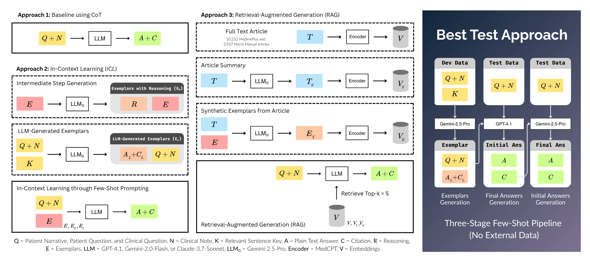

# LAMAR at ArchEHR-QA 2025: Clinically Aligned LLM-Generated Few-Shot Learning for EHR-Grounded Patient Question Answering

This repository contains the implementation of [LAMAR at ArchEHR-QA 2025](https://aclanthology.org/2025.bionlp-share.12.pdf) — 🏆 #1 on the human‑evaluation leaderboard.

## **Overview:** 
LAMAR frames EHR-Grounded Patient QA as an alignment problem. We compare various in‑context learning (ICL) and retrieval‑augmented generation (RAG) strategies. In the final submission, we developed a multistage few‑shot pipeline (no external data). First, Gemini‑2.5‑Pro generates 20 cited exemplars from the development set. GPT‑4.1 then uses these exemplars to produce initial answers on the test set. We extract citations from those outputs and, in the final stage, feed each test instance plus its retrieved references into Gemini‑2.5‑Pro to generate the final grounded answers.

## Approaches

<div align="center">
  
</div>

### 1. Baseline
- **Zero‑shot & CoT** prompting on GPT-4.1, Gemini2.0‑Flash, Claude‑3.7‑Sonnet  

### 2. In‑Context Learning (ICL)
- **Basic Few-shot**: 2 ArchEHR examples  
- **LLM-Generated Exemplars as Few-shot**: Gemini‑2.5‑Pro produces exemplar Q&A  
- **LLM-Generated Exemplars with Reasoning**: Gemini‑2.5‑Pro adds CoT rationales to exemplars

### 3. Retrieval‑Augmented Generation (RAG)
- **Corpora**: 10 232 MedlinePlus + 2 927 Merck Manual articles  
- **Embeddings**: MedCPT; indexed for retrieval  
- **Variants**:  
  1. Full‑text articles  
  2. One‑paragraph summaries  
  3. Synthetic clinical cases (formatted via few‑shot)

## Dataset

We use the [ArchEHR-QA dataset](https://physionet.org/content/archehr-qa-bionlp-task-2025/1.2/), which includes 120 patient cases (20 development and 100 test), each consisting of a clinical note and a patient-inspired question. Please find further dataset description in the [PhysioNet page](https://physionet.org/content/archehr-qa-bionlp-task-2025/1.2/).

To get started:

1. Visit the [PhysioNet page](https://physionet.org/content/archehr-qa-bionlp-task-2025/1.2/) and download the following files:
   - `archehr-qa.xml`
   - `archehr-qa_key.json`

2. Place both files inside the `data/` directory at the root of this repository.

## Configuration

1.  **Create a `.env` file** in the root of the project. You can copy the example file:
    ```bash
    cp .env.example .env
    ```

2.  **Add your API key** to the `.env` file:
    ```
    OPENAI_API_KEY="YOUR_API_KEY"
    ```

3.  **If you are using a service other than OpenAI (e.g., OpenRouter), add the base URL to your `.env` file:**
    ```
    OPENAI_BASE_URL="https://openrouter.ai/api/v1"
    ```

## Usage

You can run the experiments using either the Jupyter notebook (`experiment.ipynb`) or the command-line interface (`cli.py`).

### Notebook Interface

1.  **Open `experiment.ipynb`** in your editor.
2.  **Configure the models** at the top of the file:
    ```python
    BASELINE_MODEL = "google/gemini-2.5-pro"
    FEWSHOT_MODEL = "google/gemini-2.0-flash"
    RAG_MODEL = "google/gemini-2.5-pro"
    SUMMARIZATION_MODEL = "google/gemini-2.5-pro"
    ```
3.  **Run the cells** individually to execute each step of the experiments.

### Command-Line Interface

The `cli.py` script provides a powerful way to run experiments from the command line.

**Experiment Commands:**

```bash
# Run the baseline experiment
python cli.py baseline

# Run the basic few-shot experiment
python cli.py few-shot-basic

# Run the few-shot experiment with synthetic answers
python cli.py few-shot-syn-ans

# Run the few-shot experiment with synthetic answers and reasoning
python cli.py few-shot-syn-w-reasoning

# Run the RAG experiment
python cli.py rag

# Runs the RAG experiment with summarized
python cli.py rag-summary

# Runs the RAG experiment with synthetic case
python cli.py rag-synthetic-cases

# Run all experiments
python cli.py all
```

**Synthetic Data Generation Commands:**

```bash
# Generate synthetic answers
python cli.py generate-synthetic-answers-cli

# Generate reasoning for the synthetic answers
python cli.py generate-reasoning-cli

# Summarize articles
python cli.py summarize-articles-cli

# Generate synthetic cases from articles
python cli.py generate-synthetic-cases-cli
```

**Customizing Models:**

You can easily override the default models using the `--model` and `--summarizer` options:

```bash
# Run the baseline experiment with a different model
python cli.py baseline --model="openai/gpt-4.1"

# Run the basic few-shot experiment with a different summarizer
python cli.py few-shot-basic --model="openai/gpt-4.1"
```

## Project Structure

```
.
├── cli.py                  # Command-line interface
├── config.py               # Project configuration
├── data/                     # Raw data files
├── data_processing/        # Data loading and parsing scripts
├── evaluation/             # Evaluation metrics
├── generation/             # Prompt and answer generation scripts
├── experiment.ipynb                 # Main notebook for experiments
├── output/                 # Generated output files
├── postprocess.py          # Post-processing scripts
├── prompts/                # Prompt templates
├── rag/                    # Retrieval-Augmented Generation scripts
├── requirements.txt        # Project dependencies
├── utils/                  # Utility functions
└── README.md               # This file
```

## BibTeX Citation

If you use [LAMAR at ArchEHR-QA 2025](https://aclanthology.org/2025.bionlp-share.12.pdf) in your research, cite our paper using the following BibTex

```
@inproceedings{yoadsanit-etal-2025-lamar,
    title = "{LAMAR} at {A}rch{EHR}-{QA} 2025: Clinically Aligned {LLM}-Generated Few-Shot Learning for {EHR}-Grounded Patient Question Answering",
    author = "Yoadsanit, Seksan  and
      Lekuthai, Nopporn  and
      Sermsrisuwan, Watcharitpol  and
      Achakulvisut, Titipat",
    editor = "Soni, Sarvesh  and
      Demner-Fushman, Dina",
    booktitle = "Proceedings of the 24th Workshop on Biomedical Language Processing (Shared Tasks)",
    month = aug,
    year = "2025",
    address = "Vienna, Austria",
    publisher = "Association for Computational Linguistics",
    url = "https://aclanthology.org/2025.bionlp-share.12/",
    pages = "96--103",
    ISBN = "979-8-89176-276-3",
    abstract = "This paper presents an approach to answering patient-specific medical questions using electronic health record (EHR) grounding with ArchEHR-QA 2025 datasets. We address medical question answering as an alignment problem, focusing on generating responses factually consistent with patient-specific clinical notes through in-context learning techniques. We show that LLM-generated responses, used as few-shot examples with GPT-4.1 and Gemini-2.5-Pro, significantly outperform baseline approaches (overall score = 49.1), achieving strict precision, recall, and F1-micro scores of 60.6, 53.6, and 56.9, respectively, on the ArchEHR-QA 2025 test leaderboard. It achieves textual similarity between answers and essential evidence using BLEU, ROUGE, SARI, BERTScore, AlignScore, and MEDCON scores of 6.0, 32.1, 65.8, 36.4, 64.3, and 43.6, respectively. Our findings highlight the effectiveness of combining EHR grounding with few-shot examples for personalized medical question answering, establishing a promising approach for developing accurate and personalized medical question answering systems. We release our code at https://github.com/biodatlab/archehr-qa-lamar."
}
```
